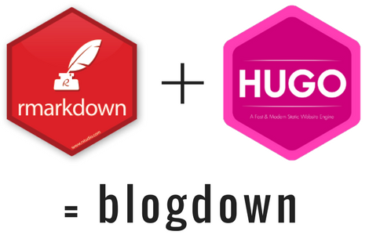

# A *VERY* brief introduction

There are tons of resources out there which can mean that it's overwhelming. 

Your first stop should be the creators' book on `blogdown`: https://bookdown.org/yihui/blogdown/

This presentation will more than loosely follow the tutorial created by one of the creators found at https://alison.rbind.io/post/2017-06-12-up-and-running-with-blogdown/

---

class: center, middle

# `blogdown` 

An R package for creating websites using RMarkdown and Hugo 

---

# Feel free to follow along

---

class: inverse, center, middle, clear

# Further Questions

<a href="mailto:ejcampos@ucla.edu"><i class="fa fa-paper-plane fa-fw"></i>&nbsp; ejcampos@ucla.edu</a>, <a href="mailto:c.shaw@ucla.edu"> c.shaw@ucla.edu</a> 
<a href="http://twitter.com/emjcampos"><i class="fa fa-twitter fa-fw"></i>&nbsp; @emjcampos</a>, <a href="http://twitter.com/cshawsome"> @cshawsome</a> 
<a href="http://github.com/emjcampos"><i class="fa fa-github fa-fw"></i>&nbsp; @emjcampos</a>, <a href="http://github.com/cshaw343">@cshaw343</a> 

Slides available at [http://bit.ly/bsa-blogdown-2020](http://bit.ly/bsa-blogdown-2020).