

# Outline 

- Motivation  
- pERP-RED Algorithm  
- pERP-Space Analysis  
- Simulation Study  
- Autism Spectrum Disorder (ASD) Study  
- Attention Deficit Hyperactivity Disorder (ADHD) Study  

???

Today I'm going to share with you all the work that I've been doing with Dr. Damla Senturk and Dr. Chad Hazlett from the Stat Department. I'll first motivate the problem with the current issues in ERP analysis, walk you through our pERP-RED algorithm and pERP-Space analysis, and then go through the simulation results as well as two examples of an analysis using data collected by the Psychiatry department. 

---

# Vocabulary 

An *Electroencephalogram* (EEG) is a non-invasive tool to measure the brain's response to a stimulus. The *Event-Related Potential* (ERP) is the measured response. 

.pull-left[
.center[
<figure></figure>
.caption[Source: http://www.lucid.ac.uk/]
]
]
.pull-right[
.center[
<figure></figure>
.caption[Source: https://www.cs.colostate.edu/]
]
]

???

I work with data from the neuroscience world so I want to introduce a few terms that I will be using. The electroencephalogram, or EEG, is a non-invasive tool to measure the brain's response to a stimulus. Your brain uses electrical impulses to communicate. The subject wears a head cap like this one. It is covered in electrodes that measure those electrical impulses, which we will call the event-related potential, at that location. The ERP is the measured response that we will be analyzing. The experiments can require a physical response, like pushing a button, but one of the advantages of EEG is that it does not require a response from the subject so they can study very small children or individuals incapable of making a motor response. I will describe later the tasks used in the different studies I'm analyzing.

---

# Current ERP Analysis 

.center[
<figure></figure>
]

Two methods:
- Peak amplitude  
- Average amplitude within a time window 

???

These are three examples of ERPs averaged over trials for each subject. On the y-axis is the electrode name and the x-axis is the time in milliseconds. These were averaged over the same task and at the same location, but the responses are wildly different. Researchers know from previous literature which ERP components to expect. For example, when presented a visual stimulus, an N100 is expected, meaning a negativity at 100 milliseconds. This may also be refered to as an N1. Then, in order to produce contrasts between treatment groups, researchers will analyze peak amplitude at a specific time or time window. So if they're studying the N100, they will look in the 80-150 millisecond range and measure the peak. After that, they conduct a simple t-test. Another method is to average the amplitude within that time window and again conduct a t-test. However, there are issues with this method of studying ERPs. It is possible that there are multiple components working in tandem with each other and the overlapping of these components ends up moving the peak towards or away from zero. This change in the component could be attributed to cognitive processes when they are in fact due to a different process. The overlapping issue a known problem in ERP analysis, but researchers press on anyways. In our paper, we propose an alternative approach to characterizing ERP components entirely. This brings me to our principle ERP-reduction algorithm.  

---

class: inverse, center, middle 

# pERP-RED Algorithm 

???

Our principle ERP-reduction algorithm, shortened to pERP-RED, generalizes ideas employed in data cleaning and source localization techiniques. This approach models ERP signals as weighted sums of an underlying set of components, where these components are defined across participants, recording sessions, electrodes, and tasks. We stray away from the named components mentioned before like N1, P3, and so on and instead refer to our derived components we refer to as principle ERPs or pERPs.

---

# Overview 

The goal is to estimate an underlying set of component waveforms -- termed principle ERPs or pERPs -- such that the ERPs formed by time-locked averages at any given electrode, participant, or trial type is approximately a weighted combination of these components. 

Let
- $i$ denote subjects, $i = 1, \ldots, N$;  
- $v$ tasks, $v=1,\ldots, V$;  
- $e$ electrodes, $e=1,\ldots,E_i$;   
- $t$ the number of time points, $t = 1,\ldots, T$; and  
- $p$ the number of pERPs, $p = 1,\ldots,P$ 

???

Before we begin going over the algorithm, we need to set notation. There are 4 dimensions of the data: subjects, tasks, electrodes, and time points. 

---

# pERP-RED Algorithm 

1. *Data initialization.* Data are split, by subject into a training and test set. Normalize each of the ERPs to unit variance.

--

2. *Electrode reduction.* Apply PCA to each of the $N$ subject-specific matrices of size $(T \times V) \times E_i$. This produces $N$ matrices of size $(T \times V) \times R_i$, where $R_i$ is the number of principal regions that explains a pre-specified amount of variance.

--

3. *Subject-region reduction.* Reshape the data above into a matrix of size $(T \times V) \times (\sum_{i=1}^N R_i)$ with all of the principal regions as the columns and the task and time data concatenated in the rows. PCA is used to generate $N_R$ principal subject-regions.

--

4. *Source separation.* Reshape data into a matrix of size $T \times (V \times N_R)$ with all task principal subject-regions as the columns and time as the rows. Fast ICA is then used to produce $P$ principle ERPs, where $P$ may be chosen by regressing the true signal onto the pERPs and obtaining an $R^2$ value.  

---

# Algorithm Steps - Schema

.center[
  <figure> 
    
  </figure>
]
.caption[
R package available at http://bit.ly/pERPred
]

???

1. Data preprocessing: Data are first split, by subject into a training set and test set. Normalize each of the resulting ERPs to have unit variance. Proceed to next steps using only the training set. 

2. Electrode reduction. The first data concentration step transforms electrode-level data within each subject to "region" level data within subject, thereby reducing the electrode dimension. This is done by applying PCA to each of the N subject-specific matrices of size (T x V) x E_i with data across electrodes in the columns and each tasks' data concatenated in the rows. This produces N matrices of size (T x V) x R_i where R_i is the number of principal regions that explains a pre-specified amount of variance. By default, we set this threshold at 80%. 

3. Subject-region reduction. The second data reduction step begins by reshaping the above data into a matrix of size (T x V) x sum over i R_i with all of the principal regions as the columns and the task and time dimensions concatenated in the rows. Each task-region ERP record is normalized to unit variance. Then PCA is used to generate N_R principle regions. 

4. Source separation. The data are then reshaped into a matrix of size T x (V x N_R) with all task principal subject regions as the columns and time as the rows. ICA is then used to produce C principle ERPs, where C may be chosen by regressing the true signal in the test set onto the pERPs and obtaining an R^2 value. 

???

Within a given participant, the correlation between activity at different electrodes stays fixed over time and tasks. In the electrode reduction step, the aim is to go from a large number of electrodes that may have highly correlated signals to a smaller set, each of which provides uncorrelated information relative to the others. Individuals' skull topography remains fixed across trials so the first assumption is a reasonable one. 

The correlation of signals carried by these principal regions across participants remains fixed across tasks. The subsequent "subject-region reduction" is analogous: if there are groups of participants that have "region" signals that are highly correlated, this information can be combined with little loss. So if my left frontal lobe and your left frontal lobe should respond similarly, we can reduce the number of regions we are using. If we aren't responding in the same way, the regions aren't removed in the PCA step. 

---

# Choosing $P$

We choose the number of pERPs $P$ according to how well this set can explain the test data. Denote the estimated pERPs as $\Phi = [\Phi_1, \Phi_2, \ldots, \Phi_P]$. Let $j = 1, \ldots, J$ be a counter running over each task, subject, and electrode combination in the test set, with $Y_j$ being the observed ERP record for the $j$th task/subject/electrode. Then we fit the model
\begin{equation*}
Y_j = \Phi\beta_j + \epsilon_j.
\end{equation*}
The variance in the test set explained by the pERPs is then
\begin{equation*}
R^2_{test} = 1 - \frac{||Y_j - \Phi\beta_j||^2}{||Y_j||^2}.
\end{equation*}
We want to choose the smallest value of $P$ such that raising $P$ would result in little gain in $R^2_{test}$.

---

# Remarks 

- At each data reduction step, we normalize the records. This makes the covariance matrix underlying the PCA steps into a correlation matrix, in keeping with our assumptions that certain correlations are stable rather than covariances.

- Keeping a larger number of components implies that more of the data will survive into the final estimates, but at the cost of keeping more noise as well. It can also become computationally costly.

- Once all the data reduction steps are done and we enter the ICA, we use ICA rather than PCA as the aim is to take the “concentrated” data and estimate components that are believed to be maximally independent, hopefully corresponding to different sources and functional processes.  

???

This step also requires a choice for the number of components to estimate, C. In principle, V × NR independent components can be kept. However there is no reason to expect that are exactly V ×N_R meaningful signals to separate. The risk of estimating too many components is that over-decomposition may occur, splitting single meaningful components into separate estimated sources. Similarly the risk of estimating too few components is that under-decomposition occurs, with separate sources remaining “mixed” together to alias as one. In our case, over-decomposition is less harmful, because we will later characterize a given ERP wave- form according to the linear combination of pERPs that compose it. The estimated pERPs can thus still “work together” to explain the average ERP for a particular condition, group or person.

That said, the smallest set of components that will suffice is preferable for interpretation. We choose the number of final components C according to how well this set can explain actual ERP data, in a test set not used to estimate the pERPs. 

---

class: inverse, center, middle 

# pERP-Space Analysis 

???

We've described how pERPs can be obtained, now we turn to how the estimated pERPs can be used in a complete analytical approach that avoids the problems inherent in the practice of using windowed peak (or mean) amplitude. The central concept is that any observed ERP waveform can be recast as a vector of coefficients describing the magnitude of each pERP's contribution to that ERP.

---

# Individual Scoring

For individual $i$ and condition $c$ at electrode $e$, let the observed ERP be denoted by the vector $Y_{i, c, e}$. We suppress the electrode index, $e$, for simplicity. Let $\Phi$ be the matrix of pERPs. We regress $Y_{i. c}$ on the pERPs to obtain the coefficients
\begin{equation*}
\omega_{i, c} = (\Phi^\mathrm{T}\Phi)^{-1}\Phi^\mathrm{T}Y_{i, c}.
\end{equation*}

Investigators are typically interested in a between-condition contrast. That is, suppose we are interested in how condition $c$ compares to condition $c^\prime$, obtaining $\omega_{i, c-c^\prime} = \omega_{i,c} - \omega_{i, c^\prime}$. 

Over all individuals, the mean vector, $\overline{\omega}_{c-c^\prime}$, would be given simply by $\frac{1}{N}\sum_i \omega_{i, c - c^\prime}$. We consider group-wise means written as
\begin{equation*}
\overline{\omega}(g)_{c-c^\prime} = \frac{1}{N_g}\sum_{i\in G_g}\omega_{i, c-c^\prime}
\end{equation*}
for group $g$, where $G_g$ denotes the set of indices, $\{i\}$, for subjects falling in group $g$ and $N_g$ denotes the size of the group. 

???

An ERP that can contain 1000 data points is now represented using only a few dimensions, while still retaining 80-90% of the total variation.

---

# Variability

We construct the standard errors that reflect the variation in those means,
\begin{equation*}
SE(g)_{c-c'} = \sqrt{\frac{\sum_{i \in G_g} \frac{ (\omega_{i,c-c'} - \overline{\omega}(g)_{c-c'})^2 }{ N_g - 1 }}{ N_g }}.
\end{equation*}

To describe variability in the loadings across individuals in group $g$ on condition $c$ or on the contrast of $c$ and $c'$, we construct the across-person standard deviation (APSD) for group $g$,
\begin{equation*}
APSD(g)_{c-c'} = \sqrt{\sum_{i \in G_g} \frac{(\omega_{i,c-c'} - \overline{\omega}(g)_{c-c'})^2}{N_g - 1}}.
\end{equation*}

---

# Inference

With these statistics, the investigator can perform a range of analyses. 

A first question is how much each pERP contributed to a given condition $c$ or contrast $c-c'$. This can be tested for any grouping $g$, by constructing
\begin{equation*}
t(g)_{c-c'} = \frac{\overline{\omega}(g)_{c-c'}}{SE(g)_{c-c'} }.
\end{equation*}

Second, we may be interested not only in which pERP contributes to a given condition or contrast for individuals in group $g$, but how this differs from what we see in group $g'$. We can similarly construct
\begin{equation*}
t(g,g')_{c-c'} = \frac{\overline{\omega}(g)_{c-c'}-\overline{\omega}(g')_{c-c'}}{\sqrt{SE(g)_{c-c'}^2 + SE(g')_{c-c'}^2}}
\end{equation*}

---

# Other uses

- Compare $\omega_{i, c-c'}$ to behavior or clinical measures for person $i$

- ERP "cleaning"

- Participant rejection

- Outlier detection

---

class: inverse, center, middle 

# Simulation

---

# Data Generation

The observed signal is assumed to be a linear combination of the pERPs. Let $Y_{i,v,e}(t)$ denote the ERP signal observed for subject $i$ at task $v$ and electrode $e$. The data generation model in the simulation will be:
\begin{equation*}
Y_{i,v,e}(t) = \sum_{p=1}^P k_{p,v,e}\phi^{\star}_p(t) + \sum_{p=1}^P \xi_{p,i,v,e}\phi^{\star}_p(t) + \sum_{\ell=1}^L \alpha_{\ell,i,v,e}\psi_\ell(t) + \zeta_{i,v,e}(t),
\end{equation*}
where the total number of  
- tasks $V = 9$  
- true pERPs $P = 5$  
- time points $T = 500$  
- Fourier bases $L = 7$  
- electrodes per subject $E = 40$ 

---

# Data Generation I 

\begin{equation*}
Y_{i,v,e}(t) = \sum_{p=1}^P k_{p,v,e}\phi^{\star}_p(t) + \sum_{p=1}^P \xi_{p,i,v,e}\phi^{\star}_p(t) + \sum_{\ell=1}^L \alpha_{\ell,i,v,e}\psi_\ell(t) + \zeta_{i,v,e}(t)
\end{equation*}

- $k_{p,v,e} \sim N(0, 0.25)$  
- $\xi_{p, i, v, e} \sim MN_{V, E}(0, \Sigma_{p, v}, \Sigma_{p, e})$  
- $\alpha_{\ell, i, v, e} \sim MN_{V, E}(0, \Sigma_{\ell, v}, \Sigma_{\ell, e})$  
- $\zeta_{i, v, e}(t) \sim N(0, \sigma^2_{error})$  

The matrices $\Sigma_{p, v}, \Sigma_{p, e}, \Sigma_{\ell, v}, \Sigma_{\ell, e}$ have a 1 on the diagonal and $\rho$ on the off-diagonal. The matrices $\Sigma_{p, v}, \Sigma_{p, e}$ are multiplied by $0.1(P - p)$ for $p = 1, \ldots, 5$ and the matrices $\Sigma_{\ell, v}, \Sigma_{\ell, e}$ are multiplied by $0.05(\ell + 1)$ for $\ell = 1, \ldots, 7$. 

We vary the number of subjects $N$, correlation of electrodes and tasks $\rho$, the amount of noise, and the percent of variation used to retain components in each of the PCA steps.

---

# Simulation Example 

As an example, we will look at the case where $N = 50$, $\rho = 0.5$ and 80% of variation is kept in the PCA steps in more detail.

.pull-left-skinny[
The proportion of variation in the records explained by the pERPs is calculated in the last step of the pERP-RED algorithm as
\begin{equation*}
R^2_{test} = 1 - \frac{||Y_j - \Phi\beta_j||^2}{||Y_j||^2}.
\end{equation*}
]

.pull-right-fat[
.center[
<figure>
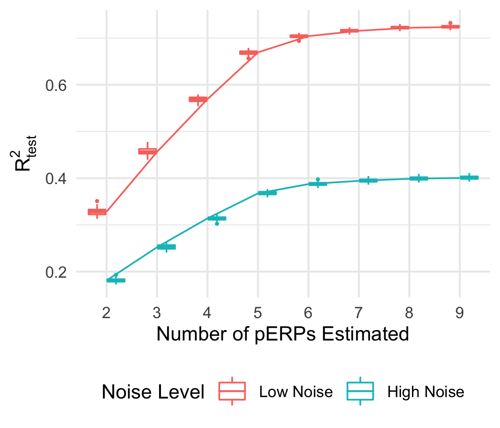
</figure>
]
]

???

In both the simulation and the real data analysis, we will always be able to regress the observed data on the estimated components. We perform this regression in a different way than we're used to doing in that we allow the regression coefficients to change for each record, where a record is the individual subject, electrode, and task combination. Essentially, in each regression we calculate the residual variance and sum them up to get an overall R2. The real takeaway here is that, we would choose the number of pERPs to estimate from a plot similar to this one. Again, we would choose 5.

---

# Simulation Example

.pull-left-skinny[
The matrix of true pERPs $\Phi^\star$ is regressed on the estimated pERPs $\Phi$ to determine the proportion of variation in the true pERPs explained by the pERPs and is calculated as
\begin{equation*}
R^2_{pERP} = 1 - \frac{||\Phi^\star - \widehat{\Phi}^\star||^2}{||\Phi^\star||}.
\end{equation*}
]

.pull-right-fat[
.center[
<figure>
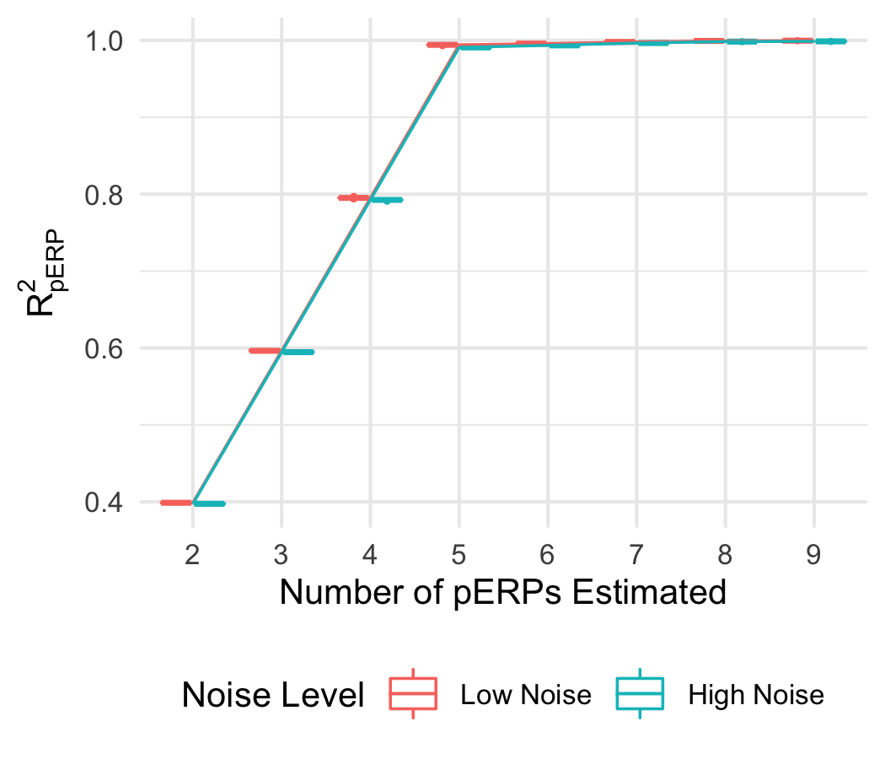
</figure>
]
]

???

In the simulation study, we know the true pERPs so we can regress this set on the estimated set and see the amount of variation explained by these estimated components. This is the formula for the R2 pERP. We use the Frobenious norm of the matrix of true pERPs minus the estimated pERPs. From the set of boxplots on the right, which are essentially lines, we see that the algorithm is correctly identifying 5 as the true number of pERPs. We won't be able to do this calculation for the real data analysis since we won't have the true pERPs but it is helpful as a sanity check. 

---

# pERP Matching 

.center[
  <figure>
   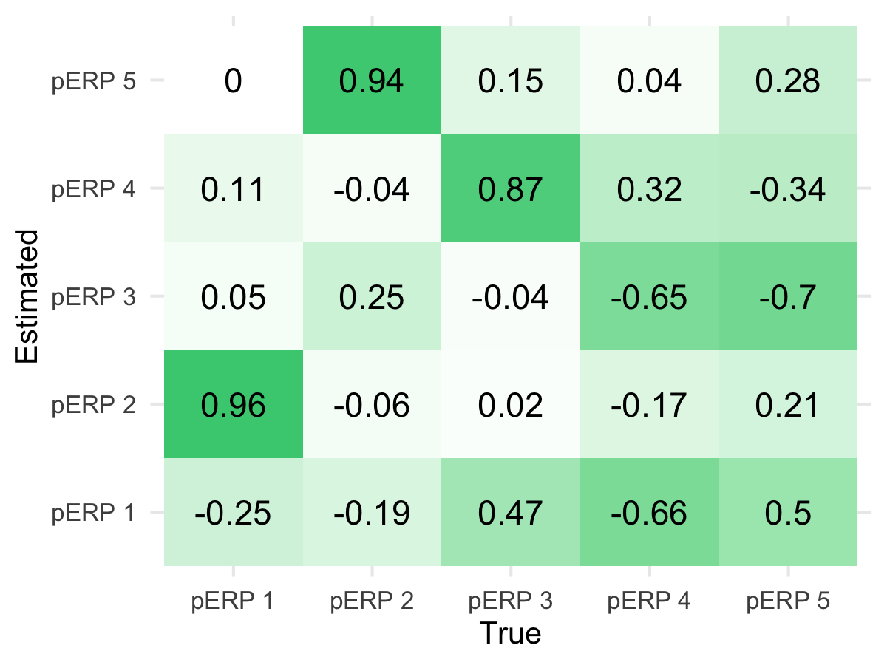
  </figure>
]

---

# Estimated pERPs

.center[
<figure>
  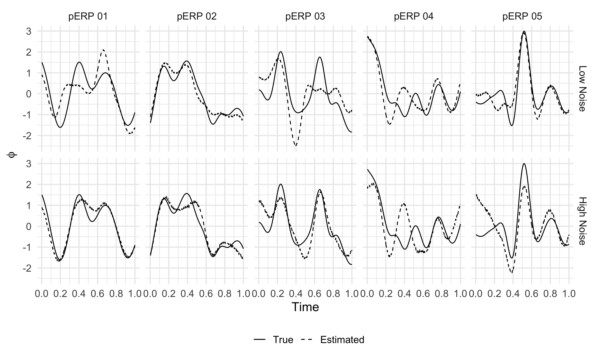
</figure>
]

???

I've attempted to match the estimated components with their corresponding true component but there isn't necessarily a one-to-one correspondance and there doesn't need to be. Our estimated components simply need to span the space of the true components and using the R2_pERP, we have shown that they do. 

---

# Effects of Sample Size

.center[
<figure>
  
</figure>
]

---

# Effects of Correlation

.center[
<figure>
  
</figure>
]

---

# Effects of Percent Variation

.center[
<figure>
  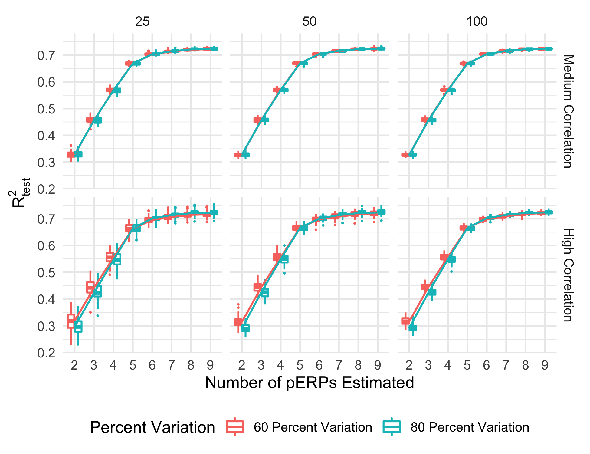
</figure>
]

---

# Comparisons to other bases

.center[
<figure>
  
</figure>
]

---

# Comparisons to other bases

.center[
<figure>
  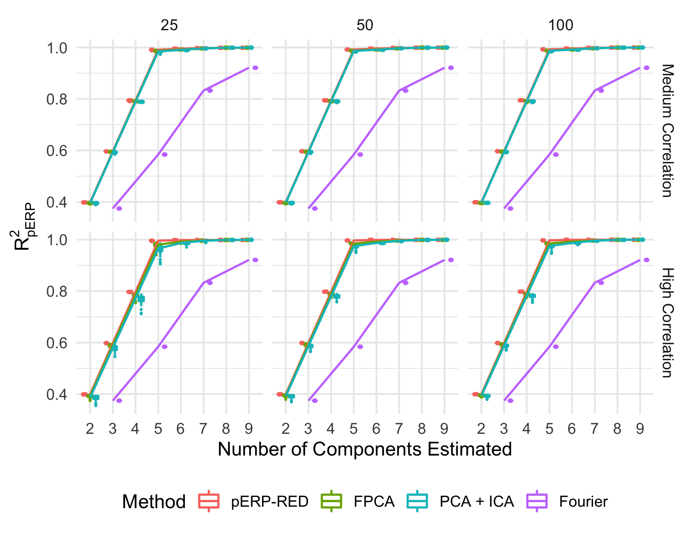
</figure>
]

---

class: inverse, center, middle 

# ASD Data Analysis

???

Now, I'm going to move onto the first dataset we received. The study was performed by a group in the Psychiatry department that included Dr. Charlotte DiStefano and Dr. Shafali Jeste. 

---

# ASD - Data Description 

Sixty children aged 5-11 years old were recruited. However, our data will include only those who were able to complete both of the experiments: 14 TD, 10 vASD, and 7 mvASD.

.pull-left[
  <figure>
   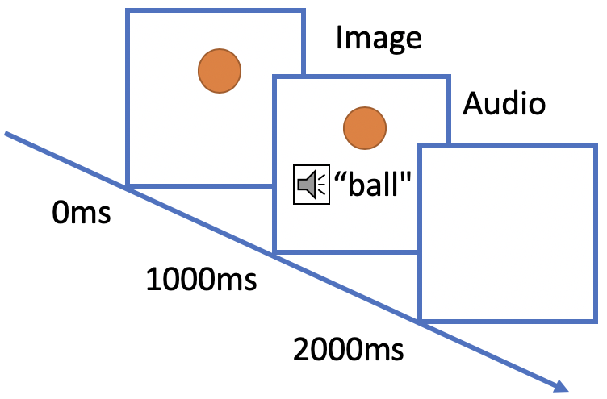
  </figure>
  .caption[
    Audio Paradigm
  ]
]

.pull-right[
<figure>
   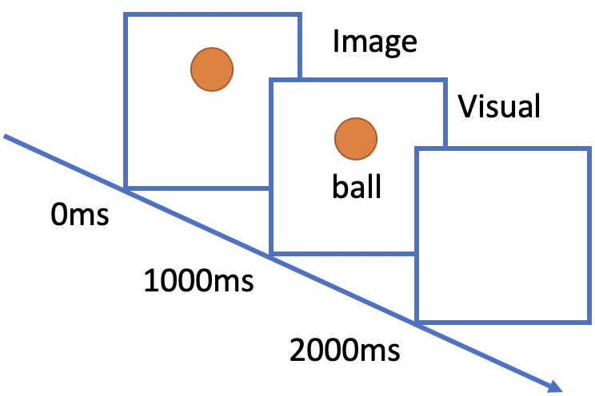
  </figure>
  .caption[
    Text Paradigm
  ]
]

  

Provided there is an internet connection, check out the [Shiny App Demo](#asdshiny).

???

The goal of the ASD study was to utilize EEG in studying neural mechanisms underlying language impairment in children with ASD, a group that is hard to study in traditional paradigms that typically require following instructions or providing behavioral responses.

In the ASD participants, diagnoses had been made prior to enrollment, through clinical diagnosis, independent clinical psychologists, child psychiatrists, and/or developmental pediatricians. These diagnoses were confirmed by the research team using the Autism Diagnostic Observation Schedule (ADOS) and Social Communication Questionnaire (SCQ).

The vocabulary in- cluded 60 basic nouns taken from the MacArthur- Bates Communicative Development Inventories-2nd edition. Examples of words included animals such as a bird or a dog and inanimate objects such as a doll or a bike. In the audio paradigm, a picture of the word would appear on a white background and the child would hear a spoken word that was either the same (match condition) or a word neither semantically nor phonologically unrelated to the word image (mismatch condition). In both conditions, the picture image appeared for 2000ms, where the auditory stimulus was played after 1000ms after the picture image was shown. Each word image pair appeared twice – once in the matched and once in the mismatched condition. No behavioral response was required. Trials were presented in four blocks of 30 trials each, totaling 6 minutes.

The visual paradigm used the same nouns and an image of the word replacing the sound of the spoken work in the audio paradigm. A word image followed a picture appearing on the same screen after 1000ms. Match or mismatch between the two stimuli (the picture and the word) would again define the two conditions of the paradigm, similar to the audio paradigm. In addition, the visual paradigm contained the same number of trials as the audio paradigm. In both paradigms, the trials were video recorded in order to remove trials in which the participants were not looking at the screen.

---

# ASD - pERPs
.center[
<figure>
  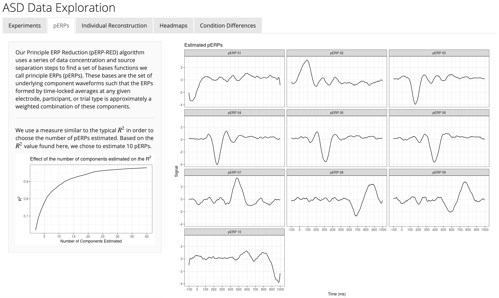
</figure>
]
.caption[
  Visit: [perpred.shinyapps.io/asd_exploration](perpred.shinyapps.io/asd_exploration)
]

???

Many of the images here are screen grabs of the two Shiny apps I created for this project. Feel free to follow along and play with my data if you'd like. The link is below this image. 

From this image, we see the R2_test plot I spoke about before, but since there was only one run, this is just a line instead of a boxplot. We chose the number of components based on where the line starts to curve, similar to a skree plot, which is at 10. To the right are the estimated pERPs.

---

# ASD - Individual Reconstruction

.center[
<figure>
  
</figure>
]
.caption[
  Visit: [perpred.shinyapps.io/asd_exploration](perpred.shinyapps.io/asd_exploration)
]

???

On the next panel, I illustrate how the individual ERP curve can be reconstructed using the estimated loadings from regressing the observed ERP on the estimated pERPs. This is great because a popular need in ERP analysis is to remove noise. 

---

# ASD - Headmaps

.center[
<figure>
  
</figure>
]
.caption[
  Visit: [perpred.shinyapps.io/asd_exploration](perpred.shinyapps.io/asd_exploration)
]

???

Additionally, we can visualize where the activity occurs on the scalp. Here, I've created headmaps that show the average loading for each pERP at each location. You can see that the first two pERPs are very active in the Image task in the occipital lobe. 

---

# ASD - Image Differences

.center[
<figure>
  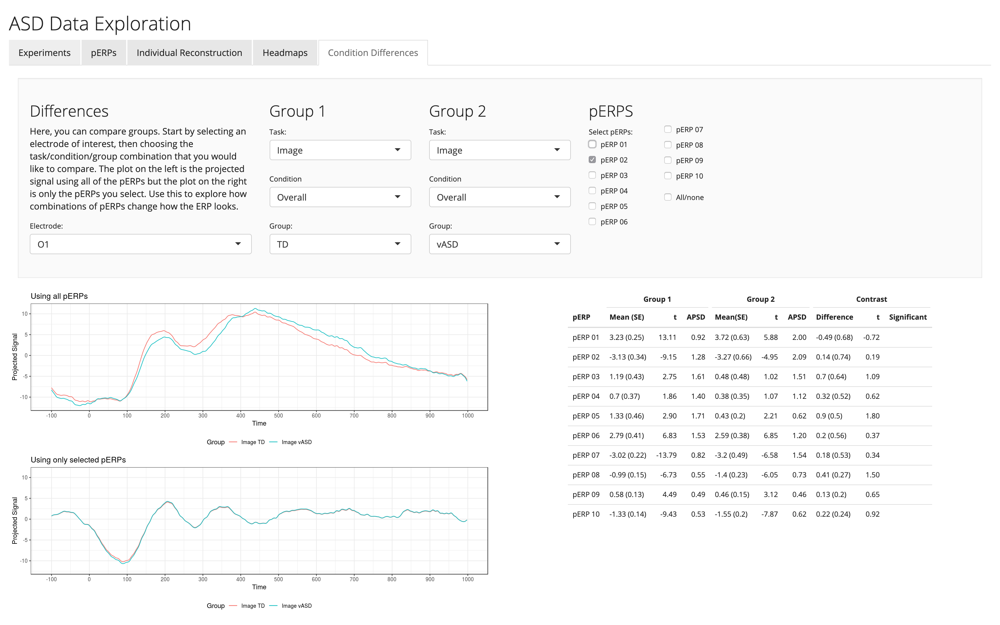
</figure>
]
.caption[
  Visit: [perpred.shinyapps.io/asd_exploration](perpred.shinyapps.io/asd_exploration)
]

???

Once we look at the headmaps, we can start to investigate where the statistically significant differences are. The last panel of my Shiny app is where you can look at any contrasts. The one I've included here is at the O1 electrode, in the visual part of the brain, for the TD and vASD groups. The plot on top is the average ERP based on all of the pERPs for each group. Notably, it's hard, if not impossible, to see the N1 which is attributed to visual stimulation. However, the plot below is the average ERP based on just the pERP 2 loadings. We see here that this is obviously capturing the known N100. There are no statistically significant differences between the TD and vASD groups here which is corroborated by previous research. Additionally, if we look at the APSD for each pERP, the variation in the loadings for the vASD group is higher than the TD group. This is an important example of where the pERP-RED algorithm and pERP-Space analysis is useful: Supposing the N1 indexed important activity we wish to measure for research or clinical purposes, it would have been ineffective to have measured it in this particular experiment using peak or mean negativity around 100ms. 

---

# ASD - Sound Differences

.center[
<figure>
  
</figure>
]
.caption[
  Visit: [perpred.shinyapps.io/asd_exploration](perpred.shinyapps.io/asd_exploration)
]

???

Perhaps a more interesting example is one with statistically significant differences. Here, in the sound task, I've contrasted the Match condition and the Mismatch condition at electrode F4 for groups TD and mvASD. The 9th pERP here has a statistically significant difference. In this study, they were looking at this long negativity from 600-900ms which they attributed to semantic integration and was found to be more negative for the mismatch condition. Essentially, this was associated with understanding whether the word matched or did not match the picture presented. Therefore, the TD and mvASD groups are reacting differently to the stimulus.  

---

name: adhd
class: inverse, center, middle 

# ADHD Data Analysis

???

I want to quickly go through another set of data we received from another group in the Psych department that included Dr. Patricia Tan and Dr. Sandra Loo. 

---

# ADHD - Data Description 

This study covers 374 participants aged 7-17 years old, with and without Attention Deficit Hyperactivity Disorder (ADHD). 

.pull-left[
  <figure>
   
  </figure>
  .caption[
    Continuous Performance Task (CPT)
  ]
]

.pull-right[
<figure>
   
  </figure>
  .caption[
    Spatial Delayed Response Task
  ]
]

Provided there is an internet connection, check out the [Shiny App Demo](#adhdshiny).

???

The tasks were a lot more complicated in this case. In the continuous performance task, the subjects are presented a letter on the screen that is either an X or not and X. They are instructed to press the spacebar only when they see an X. In the spatial delayed task, the subjects first see a fixation cross, then a series of yellow dots, then a maintenance cross, then a green dot which will either be in the same place as one of the yellow dots or not. This gives us a total of 9 tasks to be put into the pERP-RED algorithm: CPT X Correct, CPT X Incorrect, CPT Not X Correct, CPT Not X Incorrect, SDRT Cue, SDRT Maintenance, SDRT Probe, SDRT Response Correct, and SDRT Response Incorrect.

---

# ADHD -  pERPs 

.center[
<figure>
  
</figure>
]
.caption[
  Visit: [perpred.shinyapps.io/adhd_exploration](perpred.shinyapps.io/adhd_exploration)
]

???

Again, we choose the number of pERPs by the bend of the R2 plot, which happens at 15 pERPs. This is reasonable since the experiments were more complex. The pERPs are given on the right. 

---

# ADHD - N1/P2 Complex

.center[
<figure>
  
</figure>
]

???

One of the novelties of the pERP-RED algorithm is that the pERPs are derived across tasks, unlike other algorithms. In tasks with visual stimuli, there is an expected N1/P2 complex which is associated with visual stimuli and attention. Here, I've plotted the average ERP using all of the pERPs (solid line), pERP 4 (dotted) and pERP 5 (dashed) for the tasks with visual stimuli at electrode CZ. We see that pERPs 4 and 5 perfectly capture this complex in each of those tasks. 

---

# ADHD - CPT X vs Not X

.center[
<figure>
  
</figure>
<figure>
  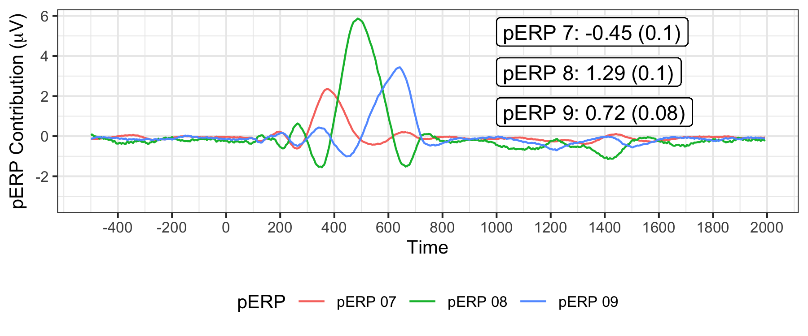
</figure>
]

???

The X Correct and Not X Incorrect tasks are contrasted because neither include a motor response. The subject correctly does not press the space bar when they see an X and incorrectly doesn't press the space bar when they see a letter other than X. Thus, the large positivity we see in the top figure in the X Correct task is expected as it indicates the novelty of seeing a rare event. 

In the bottom figure, we see that the large positivity in the X Correct task from 400-800ms can be decomposed into pERPs 7, 8, and 9. These three pERPs show a relatively sharp positivity, but at different latencies and combine to form the slower peaking positivity seen above. This highlights a potential use case as compared to examining mean or peak amplitudes. Investigators could use the loadings on each of these three components at the individual or group level to see if individual differences in clinical diagnosis or task performance correspond to different coefficients on these novelty-related pERPs. In this case, the coefficients and their contrasts on these three pERPs are actually very similar across ADHD and non-ADHD groups. They also did not vary as a function of participant age. However, this is an interesting question for further research. 

---

name: conclusions
class: inverse, center, middle 

# Conclusions

---

# Advantages and Limitations 

Adavantages

- Sidestep the long-standing concern that differences observed at a particular interval may be due to a component other than that of interest

- Addresses concerns of spillover from the prior trial 

- It can show that one broad slow-peaking structure may be explained by a combination of multiple underlying components, each of which can be measured on the group or individual level 

Limitations:

- Handle data sets in which the number of time points times the number of tasks does not exceed the number of all principal regions across all subjects (derived in the first PCA step of electrode reduction)

- pERPs are not penalized in time to a attain a desired degree of smoothness

???

We describe a method for estimating an underlying set of components and then analyzing ERP waveforms in terms of these components. To ensure the accessibility of this approach, we provide software that enables users to import ERP waveforms, estimate pERPs, and conduct the pERP-space analyses: the pERPred package in R. 

---

# Further Research

- Our algorithm analyzes data averaged over trials, we anticipate there is a possible step before the current algorithm to use the data at the trial level.

- If the investigators believe there is learning throughout the trials, it is possible to partition the trials into early/late when averaging then include them as separate tasks.

---

class: inverse, center, middle

# Questions?

<a href="mailto:ejcampos@ucla.edu"><i class="fa fa-paper-plane fa-fw"></i>&nbsp; ejcampos@ucla.edu</a> 
<a href="https://emjcampos.netlify.com"><i class="fa fa-link fa-fw"></i>&nbsp; emjcampos.netlify.com</a> 
<a href="http://twitter.com/emjcampos"><i class="fa fa-twitter fa-fw"></i>&nbsp; @emjcampos</a> 
<a href="http://github.com/emjcampos"><i class="fa fa-github fa-fw"></i>&nbsp; @emjcampos</a> 

Slides available at [link](link).

R package available at [http://bit.ly/pERPred](http://bit.ly/pERPred).

---

name: asdshiny

# Shiny App Demo - ASD

<iframe src="https://perpred.shinyapps.io/asd_exploration/" style="border: none; width: 900px; height: 500px"></iframe>

[Continue with ADHD](#adhd)

---

name: adhdshiny

# Shiny App Demo - ADHD

<iframe src="https://perpred.shinyapps.io/adhd_exploration/" style="border: none; width: 900px; height: 500px"></iframe>

[Continue with Conclusions](#conclusions)